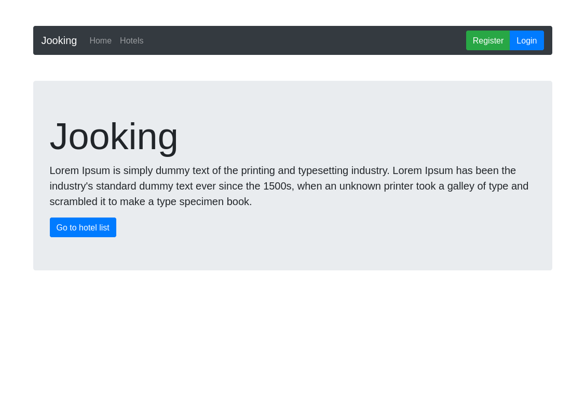
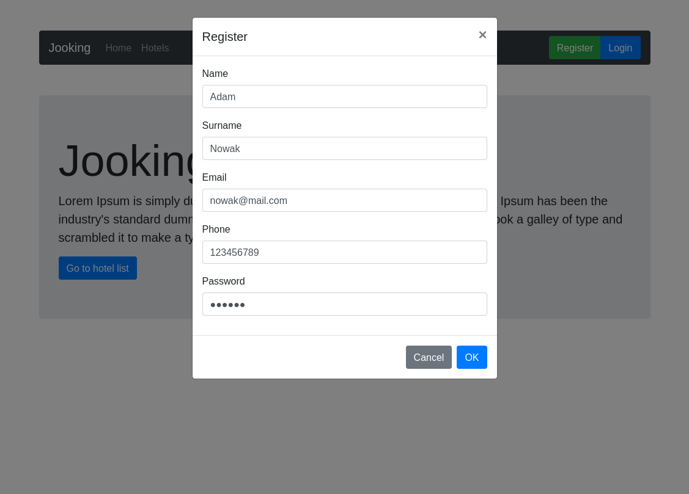
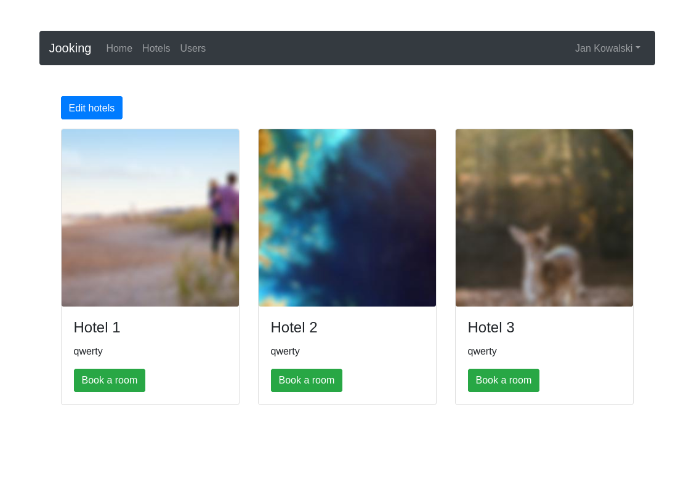
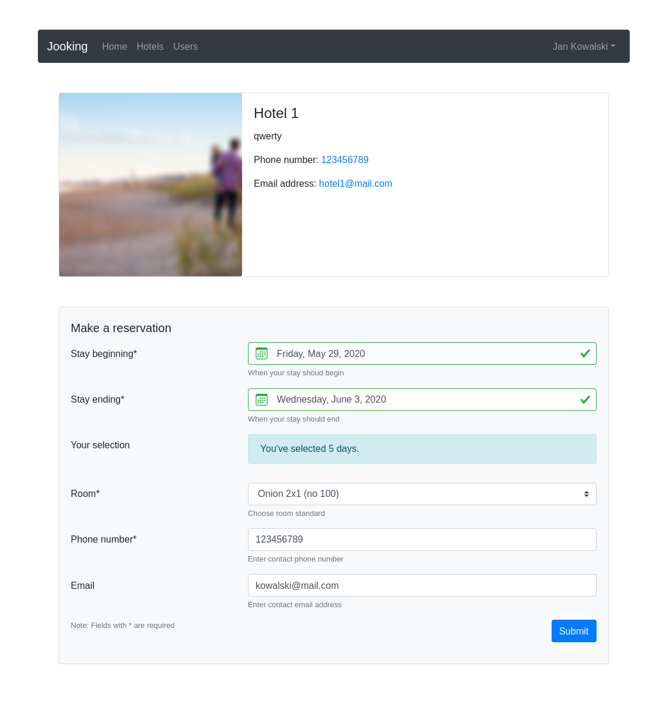
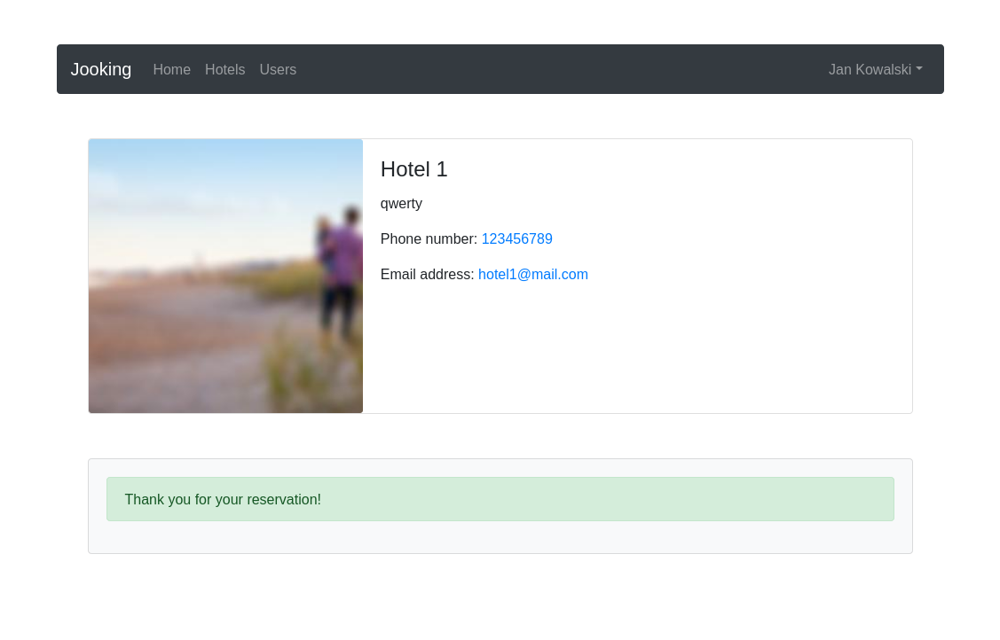
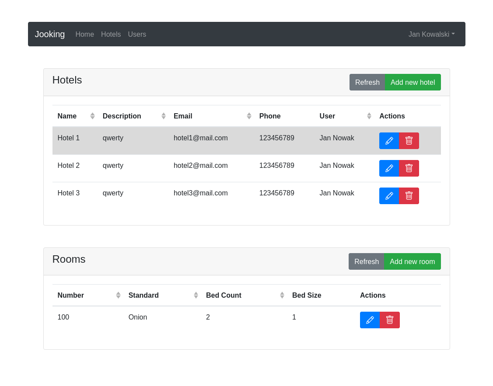
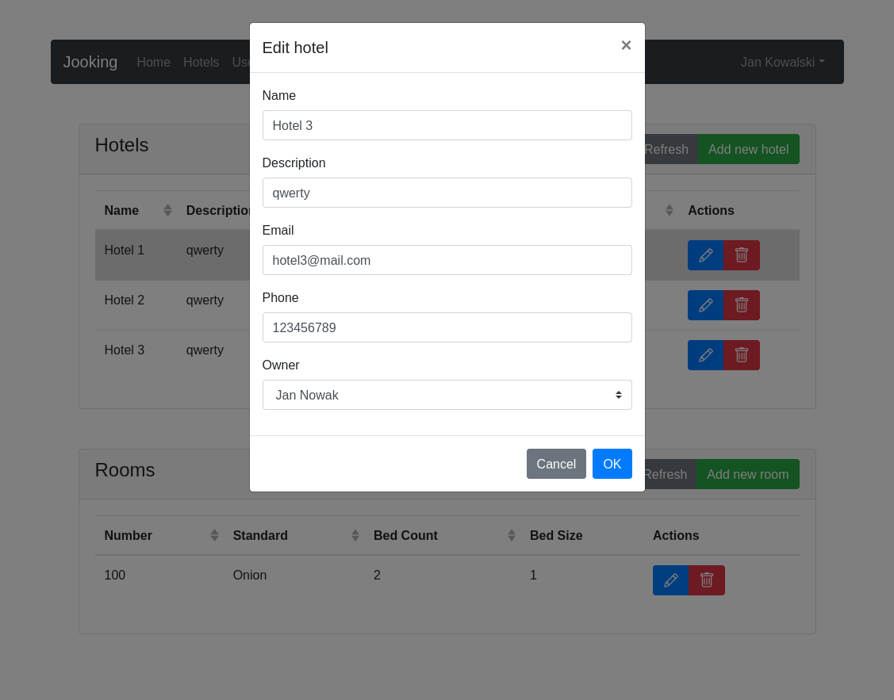
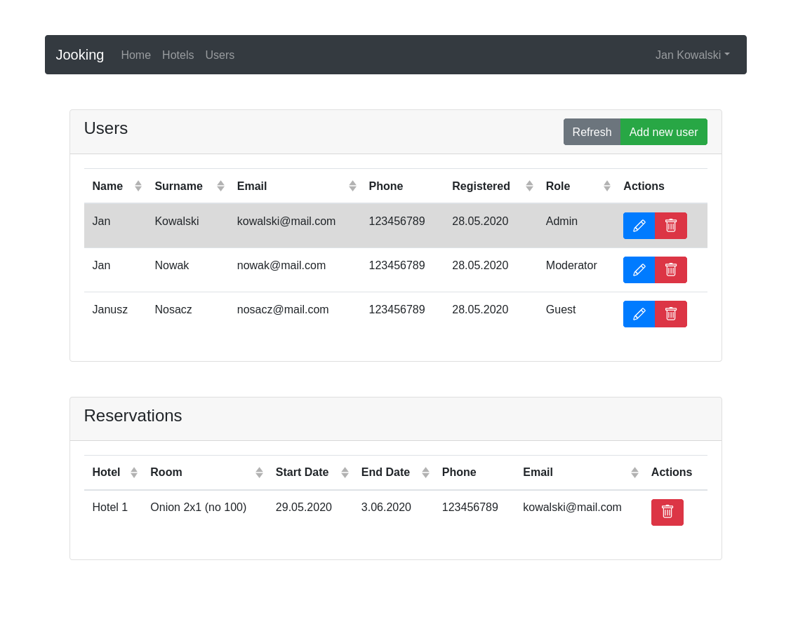
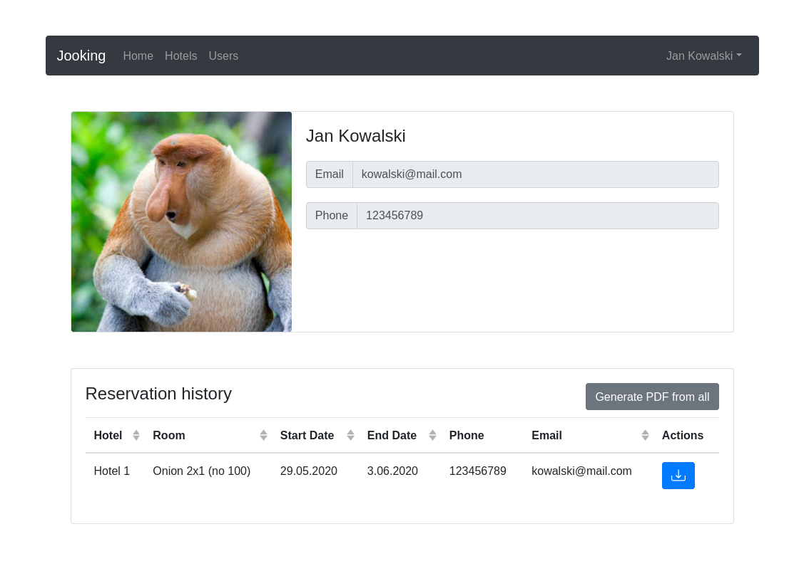

# Jooking Portal

## Overview

This project is a hotel booking platform to manage hotels, rooms and user reservations for specific days.
Architecture used is client-server with communication via REST API.
Backend application is an ASP.NET Core 3.1 API with configured InMemoryDatabase and seed data.
Frondent application is a Nuxt.js (Vue.js) server running via Node.js SSR.
Purpose of this repository is to prepare reference platform for further projects.

## Features

- Registration and login
- Hotels Management: Add, change, remove
- Hotel Rooms Management: Add, change, remove
- Users Management: Add, change, remove
- User Reservations Management: Create, remove

## Setup

### Requirements

- [ASP.NET Core 3.1 SDK](https://dotnet.microsoft.com/download/dotnet-core/3.1)
- [Node.js & npm](https://nodejs.org/en/download/)
- [Yarn (optional)](https://yarnpkg.com/getting-started/install)
- [VS Code (optional)](https://code.visualstudio.com/Download)

### Seed

#### Default accounts

Login | Password | Role | Privileges
---|---|---|---
kowalski@mail.com|qwerty|Admin|Manage users and hotels
nowak@mail.com|qwerty|Moderator|Manage hotels and reservations
nosacz@mail.com|qwerty|Guest|Making reservations

### Run

#### Using VS Code

1. Clone repository
2. Open `jooking.code-workspace`
3. Run tasks:
	- `run` from `backend`
	- `dev` from `frontend`
	- Open [http://localhost:3000](http://localhost:3000)
	- Open [https://localhost:5001/swagger](https://localhost:5001/swagger)

#### Using command line

1. Clone repository
2. Run commands:
	- `docker run` in `backend` directory
	- `yarn run dev` or `npm run dev` in `frontend` directory
	- Open [http://localhost:3000](http://localhost:3000)
	- Open [https://localhost:5001/swagger](https://localhost:5001/swagger)

## Screenshots

||||
|-|-|-|
||
||
||